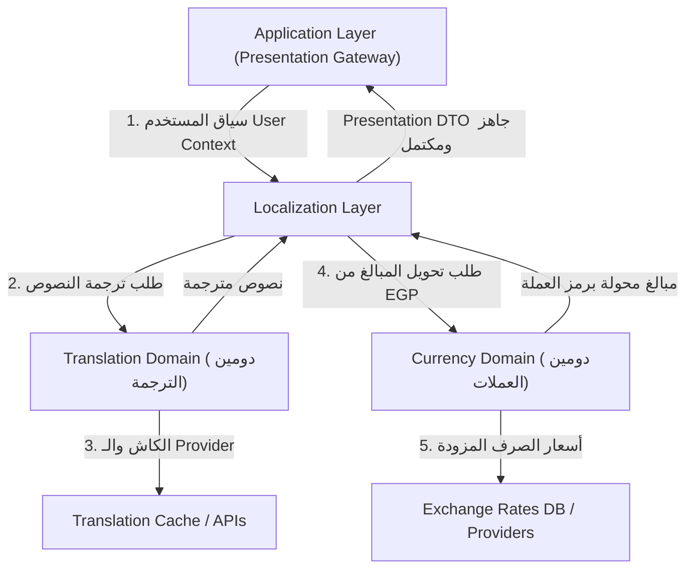

# LOCALIZATION_ARCHITECTURE.md

# العقد المعماري لنظام التوطين، الترجمة، والعملات المستقلة
## Enterprise Architectural Contract for Localization, Translation & Currency Infrastructure

---

## 📑 1. الغرض والنطاق المعماري (Architectural Scope & Purpose)

هذا المستند يمثل **العقد المعماري الثابت (Architecture Contract)** لنظام التوطين، الترجمة، والعملات في منصة **L'Aube Voyage**.

هذا العقد يُحدد **المسؤوليات، مصفوفة الملكية (Ownership Matrix)، والحدود الفاصلة بين الطبقات والدومينات** لتبقى ثابتة ومستقلة تماماً عن أي تغييرات مستقبلية في أسماء الملفات، الكلاسات، أو الدوال.

---

## 🏛️ 2. الفصل الدستوري بين دومين الترجمة، دومين العملات، وطبقة التوطين

تطبيقاً لمبادئ **الدومينات المستقلة (Domain-Driven Isolation)** في `promt.txt` و `AGENT.md`:



### أ. دومين العملات (Currency Domain) — مستقل تماماً
* **الملكية الرسمية**: المالك الوحيد الحصري لتعريف العملة الأساسية للنظام **(EGP)**، وحفظ أسعار الصرف، واستعلامات أسعار التحويل بين العملات (EGP ↔ USD, EUR, AED, SAR).
* **المسؤولية**: التنسيق مع مزودات أسعار الصرف (Exchange Rate Providers) وتوفير خدمة التحويل المالي `Exchange Service`.
* **الممنوع**: لا يعرف شيئاً عن الواجهات، التواريخ، التوطين اللغوي، أو الحجوزات.

### ب. دومين الترجمة (Translation Domain) — مستقل تماماً
* **الملكية الرسمية**: المالك الوحيد الحصري لترجمة النصوص الديناميكية (CMS Content Translation)، ودليل نصوص البنية التحتية (UI Dictionary)، وإدارة كاش الترجمات `TranslationCache`.
* **المسؤولية**: الترجمة والاحتفاظ بالكاش والتواصل مع مزودي الترجمة الآلية عند الحاجة.
* **الممنوع**: لا يعرف شيئاً عن المبالغ المالية، أسعار الصرف، أو تفاصيل الحجوزات.

### ج. طبقة التوطين (Localization Layer / Presentation Gateway)
* **الملكية الرسمية**: البوابة الحصرية (Orchestrator / Interceptor) لتجميع وتنسيق البيانات للعرض.
* **المسؤولية**:
  1. استقبال الـ Raw DTO من الـ Core Domains.
  2. طلب ترجمة النصوص من **`Translation Domain`**.
  3. طلب تحويل الأسعار من **`Currency Domain`**.
  4. تنسيق التواريخ والأرقام بحسب ثقافة العميل المحلية.
  5. إرجاع الـ DTO النهائي المكتمل بنسبة 100% لطبقة العرض.

---

## 📊 3. مصفوفة الملكية المعمارية (Architectural Ownership Matrix)

| الطبقة / الدومين (Component / Domain) | المسؤولية الرسمية (Primary Ownership) | يطلب ويستعين بـ (Delegates To) | يُمنع منعاً باتاً من (Strictly Prohibited From) |
| :--- | :--- | :--- | :--- |
| **Presentation Layer (UI / Pages)** | العرض البصري وتجميع سياق الطلب (User Context) | Application Layer / Loaders | حساب الأسعار، الترجمة، قراءة الدومينات مباشرة، أو كتابة Business Logic. |
| **Application Layer (Gateway)** | اعتراض DTOs وتنسيق العرض النهائي | Core Domains, Localization Layer | كتابة قواعد عمل جديدة أو تعديل حالات الحسابات والحجوزات. |
| **Core Domains (Booking, Experience, etc.)** | تنفيذ قواعد العمل والحفظ باللغة الإنجليزية والـ EGP | Domain Repositories | معرفة لغة/عملة العميل، أو استدعاء الترجمة والتحويل. |
| **Localization Layer** | بوابة العرض والتنسيق المحلي الشامل | Translation Domain, Currency Domain | حساب أسعار الصرف بنفسه، أو تعديل الكيانات الأساسية. |
| **Translation Domain** | ملكية الترجمة وكاش النصوص | Translation Providers / DB | التعامل مع أسعار العملات أو الحجوزات أو الهيكل البصري. |
| **Currency Domain** | ملكية العملة الأساسية EGP وأسعار الصرف | Exchange Rate Providers / DB | ترجمة النصوص أو التعامل مع لغة العميل. |

---

## 🔒 4. القوانين المعمارية الصارمة (Unbreakable Architecture Invariants)

1. **قانون الحقيقة الواحدة للبيانات (Single Source of Truth Invariant)**:
   كل حقل نصي له أصل واحد بالإنجليزية، وكل مبلغ مالي له أصل واحد بالجنيه المصري (EGP) في قاعدة البيانات. لا تُخزن ترجمات أو أسعار محولة بشكل دائم في جداول الكيانات الأساسية.

2. **قانون سياق العميل (User Context Propagation Invariant)**:
   سياق العميل (User Context) يُبنى عند نقطة دخول الطلب (Request Boundary) ويُنقل كـ Immutable Object إلى طبقة التطبيق. لا تراه ولا تقرأه الـ Core Domains.

3. **قانون عزل العملات المالي (Currency Isolation Invariant)**:
   تحويل العملات في `Currency Domain` لغرض العرض فقط (Display Purpose). أما الحجوزات والفواتير المؤكدة، فتخضع لـ Pricing Snapshot ثابت محدد بالـ EGP والعملة المختارة غير قابل للتعديل إطلاقاً.

---

## 🔄 5. التدفق المعماري المكتمل للبيانات (Complete Data Flow Contract)

```text
[Request Boundary (Page / Middleware)]
       │
       ▼ (Passes User Context: Language, Currency)
[Application Layer (Presentation Gateway)]
       │
       ├──────────────────────────────────────────────────────┐
       │ (1. Fetch Raw EGP/English)                          │ (2. Intercept Raw DTO)
       ▼                                                     ▼
[Core Domain Layer]                                 [Localization Layer]
(Booking / Experience / Destination)                         │
 (Language Agnostic: EGP & English)                          ├─────────────────────────┐
       │                                                     │                         │
       ▼                                                     ▼                         ▼
  [Raw DTO] ──────────► [Translated & Formatted DTO]   [Translation Domain]   [Currency Domain]
                                     │                      (Translate Text)      (Convert EGP Rate)
                                     ▼
                       [Presentation Layer (UI Component)]
```

---

## 🚫 6. قائمة الممارسات المحظورة معمارياً (Prohibited Anti-Patterns)

| الممارسة المحظورة (Anti-Pattern) | السبب المعماري لمنعها |
| :--- | :--- |
| **قيام Localization Layer بحساب أسعار الصرف بنفسه** | ينتهك استقلالية `Currency Domain` المسؤول الحصري عن أسعار الصرف. |
| **كتابة logic ترجمة أو تحويل عملة داخل UI Component** | يكسر عزل الطبقات ويجعل الواجهة غارقة في تفاصيل البنية التحتية. |
| **قراءة الكوكي أو الترويسات داخل Core Domain Service** | يلوث الدومين بسياق الجلسة ويمنع إعادة استخدام الخدمة في Background Jobs. |
| **استدعاء خدمة التوطين داخل الـ Repository** | ينتهك قاعدة Single Source of Truth ويخلط بين التخزين والعرض. |
| **إعادة حساب المبالغ المالية للحجوزات المؤكدة بناءً على أسعار الصرف الحالية** | ينتهك الثبات المالي للحجوزات والفواتير (Financial Immutability). |

---

## 📜 7. التوجيه الدائم للمطورين والوكلاء (Directive for Future Engineering)

* هذا العقد المعماري **مستمر وخالد** ومستقل عن أي إعادة هيكلة للملفات أو تغير في أسماء الدوال والكلاسات.
* أي كود يُخالف الحدود المحددة في **مصفوفة الملكية (Ownership Matrix)** في هذا المستند يُعد **خرقاً معمارياً جثيماً (Architectural Violation)** ويجب رفضه وإعادة بناء منطق الحركة وفقاً لهذا العقد.
