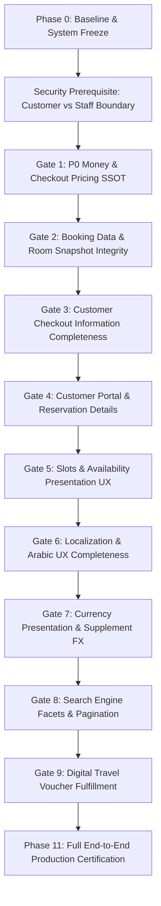

# 🛡️ GLOBAL ARCHITECTURAL INTEGRITY LOCK
## Applies to EVERY Phase, Gate, Remediation, Test, Migration, and Certification Step

This section is NON-NEGOTIABLE and has higher priority than any individual remediation convenience.

### 1. ZERO DUPLICATION — ABSOLUTE RULE

NEVER create a second implementation of an existing business rule, calculation,
repository capability, mapper, policy, service, workflow, formatter, validator,
authorization rule, or data-access strategy.

Before creating ANY new:
- function
- class
- service
- policy
- repository method
- query
- DTO
- mapper
- hook
- utility
- helper
- cache
- formatter
- validation rule
- component
- API route

the agent MUST first perform repository-wide reconnaissance and prove that
the required capability does not already exist.

If an existing capability exists:
→ reuse it
→ extend it at its authoritative owner when necessary
→ do NOT create a parallel implementation.

### 2. ONE BUSINESS RULE = ONE OWNER

Every business rule MUST have exactly one authoritative owner.

Examples:
- **Pricing**: `BookingPricingUseCase` / Pricing Domain
- **Occupancy**: `RoomAllocationPolicy` / Experience Domain
- **Child age classification**: `ChildPolicy` / Experience Domain
- **Booking lifecycle**: Booking State Machine / Booking Domain
- **Payment lifecycle**: Payment Domain
- **Customer vs Staff identity**: `SessionResolver` / Auth Application Boundary
- **Currency conversion**: Currency / Localization Domain
- **Translation**: `JsonTranslationDictionary` / Localization Domain
- **Loyalty balance and redemption**: Loyalty Domain / Ledger SSOT
- **Inventory/capacity**: Inventory/Booking domain authority

Presentation components and Server Actions MUST NOT recreate these rules.

### 3. NO PARALLEL TRUTH

Never introduce a second representation that can become authoritative independently of the existing SSOT.

Do not create:
- duplicate pricing calculations
- duplicate occupancy calculations
- duplicate child calculations
- duplicate currency conversion
- duplicate translation resolution
- duplicate booking-state transitions
- duplicate customer authorization logic
- duplicate inventory availability logic

DTOs are presentation contracts, NOT business authorities.

### 4. NO "JUST FOR THIS GATE" CODE

The agent MUST NOT introduce temporary architecture such as:
- temporary helper
- temporary fallback
- compatibility calculation
- migration-time business rule inside runtime code
- duplicated query "just for checkout"
- special-case experience handling
- hardcoded production value
- route-specific business logic
- component-specific pricing
- emergency bypass
- try/catch suppression
- silent data repair

There is no concept of "temporary production architecture". If code is required, it must belong permanently to the correct architectural owner.

### 5. RECONNAISSANCE BEFORE CREATION

Before modifying or creating anything, inspect:
1. Existing domain services
2. Existing policies
3. Existing repositories
4. Existing use cases
5. Existing DTOs
6. Existing mappers
7. Existing workflows
8. Existing events
9. Existing actions
10. Existing tests
11. Existing callers/consumers
12. Existing database schema
13. Existing production data paths

Then document:
- Existing capability
- Existing owner
- Existing consumers
- Why reuse is sufficient OR why the authoritative owner must be extended

No implementation before this analysis.

### 6. NO ARCHITECTURAL ESCAPE

Never move business logic into:
- React components
- Server Components
- Client Components
- API routes
- Server Actions
- loaders
- hooks
- event handlers

when that logic belongs to a Domain/Application owner. These layers orchestrate and present; they do not become new business-rule authorities.

### 7. NO QUERY DUPLICATION

If a repository already exposes the required data capability:
→ reuse it.

If it is insufficient:
→ extend the existing repository authority.

Do NOT create another repository method with the same semantic purpose under a different name. Do NOT create a direct SQL query in a loader/action/component merely because it is faster to implement.

### 8. NO DTO DUPLICATION

Before creating a DTO:
→ search for existing DTOs carrying the same semantic information.

If an existing DTO can be extended safely:
→ extend it.

If a new DTO is genuinely required because the consumer has a different read contract:
→ document why it cannot reuse the existing DTO.

DTOs must remain projection contracts and must never become alternate SSOTs.

### 9. NO FALLBACKS THAT HIDE ARCHITECTURAL FAILURE

The following are strictly forbidden:
- `try/catch` → return empty data
- missing data → default value
- invalid configuration → guessed value
- missing pricing → base-price calculation
- missing translation → silently substitute English
- missing currency rate → guessed rate
- invalid occupancy → default to Double
- missing accommodation → omit accommodation
- authorization failure → infer identity from numeric ID

Failure MUST remain observable.

### 10. LOADING ≠ FALLBACK

A loading state is UI state. It MUST NOT be implemented by:
- empty successful data
- zero totals
- fake records
- placeholder commercial values
- previous stale result presented as current truth

### 11. DATABASE IS NOT TO BE "FIXED" SILENTLY

If production data violates the new schema:
DO NOT:
- silently sanitize it
- silently delete fields
- silently invent defaults
- silently convert it during reads

Instead:
1. identify the corrupted/incomplete record
2. report it
3. define an explicit migration/remediation
4. execute the migration deliberately
5. verify the resulting database state

### 12. TESTS MUST NOT CREATE A SECOND ARCHITECTURE

Tests may use controlled fixtures, but MUST exercise the real production domain rules. Do not duplicate commercial formulas inside tests and then compare the production calculation against the duplicated formula.

Prefer:
$$\text{Production SSOT} \rightarrow \text{calculation} \rightarrow \text{assertions on invariant/result}$$

### 13. REAL PRODUCTION PATH ONLY

Verification MUST follow the actual production path:
$$\text{Customer/UI} \rightarrow \text{Application boundary} \rightarrow \text{Domain SSOT} \rightarrow \text{Repository/DB} \rightarrow \text{Stripe/External} \rightarrow \text{Persisted state}$$

Mocked browser success is NOT production verification.

### 14. GATE IS BLOCKED IF ARCHITECTURAL OWNERSHIP IS UNCLEAR

If the agent cannot answer:
*"Who owns this rule?"*
then implementation MUST STOP. Do not solve ownership ambiguity by creating a new helper/service.

### 15. CHANGE BOUNDARY DISCIPLINE

Every gate MUST report:
- Files inspected
- Files modified
- Existing capability reused
- Existing SSOT reused
- New capability introduced
- Why new capability was necessary
- Business-rule owner
- Data owner
- Presentation owner
- Tests added/changed
- Database changes
- Migration requirements
- Regression verification

### 16. DEFINITION OF ARCHITECTURAL SUCCESS

A remediation is successful only when:
$$\text{Existing SSOT} \rightarrow \text{Existing architectural owner} \rightarrow \text{Existing production path} \rightarrow \text{Correct consumer}$$
NOT:
$$\text{Existing SSOT} \rightarrow \text{New helper} \rightarrow \text{New calculation} \rightarrow \text{New DTO} \rightarrow \text{New workaround}$$

### 17. FINAL ARCHITECTURAL CERTIFICATION

Before Phase 11 PASS, perform a repository-wide duplication audit. Search for duplicated implementations of:
- pricing
- occupancy
- child pricing
- child classification
- currency conversion
- translation
- loyalty
- booking transitions
- authorization
- inventory/capacity
- accommodation semantics
- pagination/data retrieval

Any unresolved duplicate authority means: **STATUS: BLOCKED**.

---

## 🚨 UNIVERSAL STOP CONDITIONS

At ANY point, immediately stop the current gate if:
- An existing SSOT cannot be located.
- Two competing implementations of the same business rule are discovered.
- A proposed change would create a second business-rule owner.
- A new helper/service is proposed without repository-wide duplication audit.
- A fallback is required to make the gate pass.
- Existing invalid production data must be hidden instead of explicitly migrated.
- A component/action/route begins containing domain business logic.
- A test passes only because it mocks the production path.
- Browser verification cannot reach the real production path.
- Database evidence contradicts the application result.
- The persisted commercial snapshot differs from the authoritative pricing result.
- Stripe amount differs from the authoritative server amount.
- Historical booking data requires re-reading mutable catalog data to reconstruct truth.

**Result**: **STATUS: BLOCKED**. No workaround is permitted.

---

# PRODUCTION FAST-TRACK REMEDIATION PLAN
## L'Aube Voyage Rebuild — End-to-End Architectural Integration

> **Execution Directive:** Production Fast-Track Mode  
> **Guiding Principle:** *"Don't rebuild the engines. Connect the truth."*  
> **Rule:** Strict priority order, zero patchwork, zero fake browser verification, and verification of real database state after each gate.

---

## 1. Executive Strategy & Phasing Overview

---

## 2. Phase 0 — Baseline & System Freeze (COMPLETED ✅)

1. Git commit baseline: `3c94381`
2. `pnpm exec tsc --noEmit`: 0 errors.
3. `pnpm test:run`: 100% passing.
4. Production build: Clean bundle output.
5. Real PostgreSQL DB records documented for Experience #693, Departure Slots, Point Ledger, Currencies.

---

## 3. Security Prerequisite: Customer vs Staff Identity Boundary (COMPLETED & AUDITED 🟢)

### 1. Finding & Architectural Principle
- `SessionResolver.resolve()` must strictly partition identities:
  - When `user.collection === 'users'` (Staff/Admin):
    `userId = Number(user.id)`, `customerId = undefined`, `role = user.role || 'admin'`.
  - When `user.collection === 'customers'` (Travelers):
    `customerId = profile.customerId`, `userId = undefined`, `role = 'customer'`.
- Customer checkout strictly requires:
  `session.role === 'customer' && session.customerId`.
  Staff/Admin accounts attempting customer checkout are explicitly rejected.
- Admin actions (`cancelAdminBookingAction`, `refundAdminBookingAction`, etc.) strictly require `session.userId`.
- Regression risk: Intended low; demonstrated by full consumer audit and automated verification.

---

## 4. Gate 1 (🔴 P0): Server-Side Pricing SSOT Reconstruction on Checkout Submission

### 1. Mandatory Architectural Invariants
1. **One Calculated Result $\rightarrow$ One Authoritative Persisted Snapshot**:
   `pricingSnapshot` and `commercialBreakdown` are derived strictly from the same calculation by `BookingPricingUseCase`. Never pass or allow them to diverge.
2. **Standard Domain Terminology**:
   Use `childrenCount`, `childAges`, `childBeddingModes`, `requestedRooms` consistently. No aliases or conflicting contracts.
3. **Intent vs. Authority (Client Input is Never Authority)**:
   The client submits intent. The server strictly validates:
   - `adultsCount + childrenCount + infantsCount === travelers.length`
   - `childrenCount === childAges.length === childBeddingModes.length`
   Server action MUST NEVER execute pricing formulas itself.
4. **Removal of BookingCreator Fallback**:
   `BookingCreator` has NO fallback pricing algorithm. The legacy fallback `totalBasePriceEGP = basePricePerPerson * travelersCount` is completely removed. Missing breakdown/snapshot causes immediate fail-fast error.
5. **No Hardcoded Dummy Prices in Verification**:
   Verification derives expected amounts directly from DB configuration + Pricing SSOT.
6. **Loyalty Eligibility Re-evaluation**:
   Client provides `pointsToRedeem` as intent. Server recalculates customer balance and max allowable redemption through Loyalty SSOT. Arbitrary client point claims are rejected.

### 2. Definition of Done
$$\text{Quoted Preview Total} = \text{Final Server Pricing SSOT Total} = \text{Persisted Snapshot Total} = \text{Stripe Session Total}$$

Covers: Single, Double, Triple, Quad, multiple rooms, child sharing, child extra bed, infant, loyalty redemption, multi-stay.
Security: Admin checkout rejected, Customer allowed.
Integrity: Tampered client prices/supplements/totals ignored; invalid child policy rejected; invalid occupancy rejected; missing authoritative pricing rejected.
Persistence: Real DB records prove saved amounts originate strictly from server calculation.

---

## 5. Gate 2 (🔴 P1): Booking Data Integrity & Room Allocation Snapshot Persistence

- Room assignments (`roomAllocation[]`) and stay contracts (`stays[]`) preserved immutably inside `pricingSnapshot.commercialBreakdown`.
- Historical booking truth is never recalculated from mutable catalog records.

---

## 6. Gate 3 (🔴 P1): Customer Checkout Information Completeness

- `CheckoutPageDTO` and `CheckoutPage.tsx` display accommodation card: hotel property name, room category, board basis, and room layout.

---

## 7. Gate 4 (🔴 P1): Customer Portal Reservation Details Completeness

- Customer reservation page (`/dashboard/bookings/[id]`) renders full dossier: Passenger Manifest, Hotel Stays, Room Layout, Payment Receipt.

---

## 8. Gate 5 (🟠 P1): Slots & Availability Presentation UX

- Departure slots presentation respects real inventory capacity and cutoff rules.

---

## 9. Gate 6 (🟠 P1): Bilingual Completeness & Localization SSOT

- Zero hardcoded English strings in `ExperienceDetailsPage.tsx` when viewed in Arabic (`laube-locale=ar`). All strings served via `JsonTranslationDictionary`.

---

## 10. Gate 7 (🟠 P1): Currency Presentation Consistency & Supplement FX

- Room occupancy supplement badges and all price tags dynamically converted and displayed in customer's chosen currency via `CurrencyDisplay` and `localization.formatPrice()`.

---

## 11. Gate 8 (🟡 P2): Global Search UI Facets, Price & Pagination Controls

- Connect search facets, category tabs, and functional pagination to `GlobalSearchPage.tsx`.

---

## 12. Gate 9 (🟡 P2): Printable Reservation Confirmation & UX Cleanup (COMPLETED 🟢)

- Converted the existing Reservation Dossier at `/dashboard/bookings/[id]` into an official printable document.
- Wired functional print action via `window.print()` and isolated print stylesheet (`@media print` / `print:*`) hiding dashboard chrome (sidebar, header, navigation, and controls).
- Cleaned misleading "Voucher" terminology across production UI and aligned with localization SSOT (13 locales, 100% parity).
- Zero duplicated collections, zero new DB tables, zero server-side PDF bloat. All printed data sourced directly from immutable Booking Snapshot.

---

## 13. Phase 11 — Full Production Certification Protocol

End-to-end certification across Anonymous Visitor, Booking Flow, Customer Checkout, Stripe Test Payment, and Post-Booking Verification.

---

## 14. Summary Execution Schedule

| Step | Scope | Blocker Level | Gate Validation |
| :---: | :--- | :---: | :--- |
| **Phase 0** | Baseline & System Freeze | Non-negotiable | `tsc`, `pnpm test`, `pnpm build` clean |
| **Security** | Customer/Staff Identity Boundary | Security P1 | Staff checkout blocked; Customer verified; Consumers audited |
| **Gate 1** | P0 Money & Checkout Pricing SSOT | P0 Blocker | Quoted = Server SSOT = DB Snapshot = Stripe Total |
| **Gate 2** | Booking Data & Room Snapshot | P1 Blocker | DB snapshot contains rooms & stays |
| **Gate 3** | Customer Checkout Completeness | P1 Blocker | Stays & room layout visible on `/checkout` |
| **Gate 4** | Customer Portal Details | P1 Blocker | Manifest & stays visible on `/dashboard/bookings` |
| **Gate 5** | Slots & Availability UX | P1 Blocker | Real slot capacity & cutoff respected |
| **Gate 6** | Localization & Arabic UX | P1 Blocker | Zero English in Arabic Experience Details |
| **Gate 7** | Currency Presentation Leak | P1 Blocker | Room supplements formatted in active FX |
| **Gate 8** | Search Facets & Pagination | P2 Quality | Search pagination & category filter work 🟢 CLOSED |
| **Gate 9** | Printable Reservation Confirmation | P2 Quality | Browser-based print confirmation & UX cleanup 🟢 CLOSED |
| **Phase 11**| Full Production Certification | Final Gate | 100% End-to-end verified with real DB evidence 🔴 Remaining |
