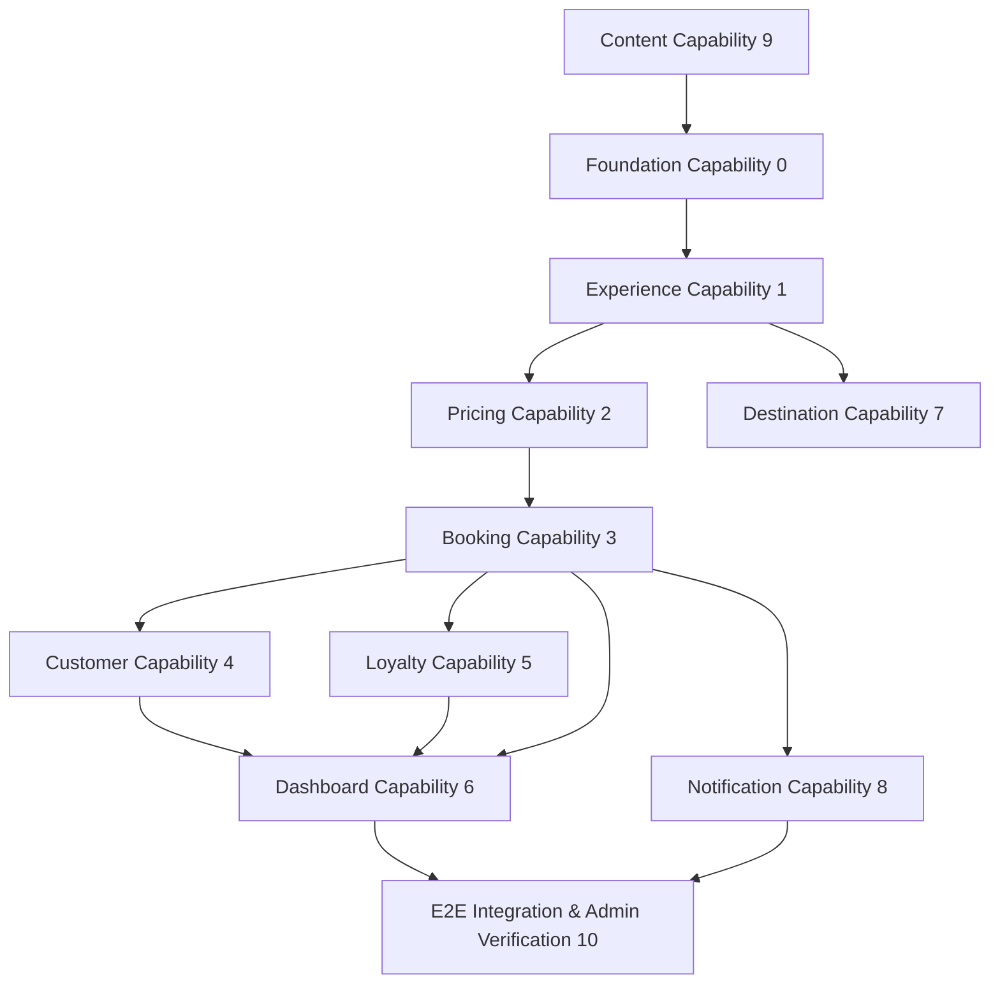

# SYSTEM_INTEGRATION_AUDIT (التدقيق المعماري وتكامل النظام الشامل)

تعتبر هذه الوثيقة المرجع المعماري الرسمي والنهائي لإدارة وتنفيذ مرحلة تكامل النظام (System Integration) بالاعتماد على منهجية **التكامل الأفقي المبني على القدرات (Capability-Driven Integration)**، لتفادي تكرار الأكواد وضمان مطابقة معايير الدستور.

---

## 1. مخطط الاعتماديات بين القدرات (Capability Dependency Map)

يوضح المخطط التالي سريان الاعتماديات والتبعيات بين القدرات التشغيلية المختلفة في النظام، مما يفرض ترتيبًا هندسيًا صارمًا للتنفيذ بحيث لا نبدأ في دمج قدرة تعتمد على قدرات أخرى لم يتم إغلاقها وتأكيد مطابقتها للدستور بعد:

* **التفسير المعماري**: 
  1. تبدأ العملية بـ **القدرة التأسيسية (Capability 0)** لتأكيد سلامة الأنماط والـ Loader والمكونات المشتركة.
  2. تليها **كتالوج الرحلات (Capability 1)** كأساس لتعريف المنتجات في النظام.
  3. تعتمد **التسعير وحسابات العملات (Capability 2)** على بيانات المنتج الأساسية.
  4. تعتمد **الحجوزات والـ Checkout (Capability 3)** كلياً على الأسعار والرحلات.
  5. تعتمد **العملاء والولاء والإشعارات** على الحجوزات، بينما تصب جميعاً في **لوحة التحكم (Capability 6)**.
  6. تنتهي الدورة بـ **المطابقة النهائية للإدارة (Capability 10)**.

---

## 2. محاور التدقيق المعماري العشرة (Architectural Forensics Dimensions)

1. **مصدر الحقيقة (Source of Truth)**: التأكد من قراءة البيانات من مستودعها الأصلي (نظام Ledger للولاء، وحقول كولكشن الرحلات للمعرض والوصف).
2. **تدفق البيانات (Data Flow)**: ضمان قراءة العملات واللغات بشكل حيوي عبر الكوكيز وتدفقها بنجاح للـ Loaders والمكونات.
3. **ملكية الدومين (Domain Ownership)**: التحقق من عدم التفاف الطبقات المعمارية (بمثيل استخدام الـ Repository مباشرة في المكونات).
4. **تدقيق الموك (Mock Audit)**: تصنيف واستبدال العناصر الصورية والافتراضية.
5. **تدقيق القيم الصلبة (Hardcode Audit)**: جرد ونقل الإعدادات المدمجة برمجياً إلى كولكشن النظام وقاعدة البيانات.
6. **اتساق الواجهات (UI Consistency)**: استخدام مكون `CurrencyDisplay` بشكل مطلق لعرض الأسعار والعملات.
7. **تدقيق اللودر (Loader Audit)**: حظر منطق الأعمال في اللودرات وتطبيق سياسة **Fail Fast**.
8. **مسؤولية المكونات (Component Responsibility)**: إجبار المكونات على العمل كمظهر للعرض فقط.
9. **تدقيق الأحداث (Event Audit)**: فحص اكتمال سريان الأحداث لإعادة بناء الكاش والـ Projections.
10. **تكامل الإدارة (Admin Integration)**: ضمان انعكاس تعديلات الـ CMS مباشرة على الواجهة.

---

## 3. جرد وتوثيق القدرات التشغيلية (Capability Integration Cards)

فيما يلي بطاقات الجرد والتكامل لكل قدرة تشغيلية في النظام، شاملة التقييم والاعتماديات وقسم معايير الاكتمال الإلزامي (Definition of Done) لكل منها:

### Capability 0: Foundation Capability (القدرة التأسيسية الهيكلية)
* **المسؤولية**: التحقق من سلامة الأنماط والمكونات المشتركة قبل البدء في القدرات التشغيلية الحيوية.
* **المكونات والخدمات**: DTOs, Loaders, Event naming rules, Localization Context, `CurrencyDisplay` component, Fail Fast policies.
* **الاعتماديات**: لا يوجد (تأسيسية).
* **حالة التنفيذ**: **⚠️ Warning** (توجد بارامترات افتراضية صلبة لـ `customerId = 1` وصياغة أسعار يدوية بصفحة نجاح الدفع).
* **معايير الاكتمال (Definition of Done)**:
  - [ ] Schema readiness verified
  - [ ] DTO naming conventions standardized
  - [ ] Loader conventions enforced (no Business Logic)
  - [ ] Event naming consistency verified
  - [ ] Currency & Localization context cascades verified
  - [ ] Fail Fast compliance checked (No hardcoded configs)
  - [ ] Shared Presenter `CurrencyDisplay` implemented and active
  - [ ] Shared Components audited
  - [ ] Architecture rules verified and compiled
  - [ ] Tests passing

---

### Capability 1: Experience Presentation Capability (عرض الرحلات والكتالوج)
* **المسؤولية**: عرض الكتالوج العام للرحلات وتفاصيل كل رحلة ديناميكياً من قاعدة البيانات.
* **المكونات والخدمات**: `ExperienceService`, `ExperienceDetailsLoader`, `ExperiencesCatalogLoader`, `Experiences` collection.
* **الاعتماديات**: `Capability 0`
* **حالة التنفيذ**: **✅ Approved**
* **معايير الاكتمال (Definition of Done)**:
  - [x] Schema complete (إضافة حقل `itinerary` كحقل Array في `Experiences.ts`)
  - [x] Repository complete (`ExperienceRepository` fully functional)
  - [x] Services complete (Domain queries and slots resolution active)
  - [x] Workflow complete (`ExperienceWorkflowEngine` handles status transitions)
  - [x] Events complete (Emits `EXPERIENCE_MUTATED` on change)
  - [x] Admin complete (CMS supports editing slots, inclusions, and itineraries)
  - [x] Loader complete (`ExperienceDetailsLoader` reads real DB fields: gallery, itinerary, included, excluded, description)
  - [x] DTO complete (`ExperienceDetailsDTO` contains DB models instead of mocks)
  - [x] Presentation complete (`ExperienceDetailsPage` renders dynamic images and itinerary steps)
  - [x] No Hardcode (No mock titles or static default descriptions in loader)
  - [x] No Mock Business Logic
  - [x] No Duplicate Logic
  - [x] Fail Fast compliant (Throws errors if slots or pricing data is invalid)
  - [x] Localization compliant
  - [x] Currency compliant
  - [x] Constitution compliant
  - [x] Tests passing
  - [x] Manual verification completed

---

### Capability 2: Pricing & Currency Capability (التسعير وصرف العملات)
* **المسؤولية**: إدارة سعر الصرف وتحويل العملات وحساب أسعار الباقة ديناميكياً مع الضرائب والخصومات.
* **المكونات والخدمات**: `CurrencyService`, `PricingFacade`, `PricingPipeline`, `ExchangeRates` collection.
* **الاعتماديات**: `Capability 0`, `Capability 1`
* **حالة التنفيذ**: **✅ Approved**
* **معايير الاكتمال (Definition of Done)**:
  - [x] Schema complete (Currencies and exchange rates schemas verified)
  - [x] Repository complete
  - [x] Services complete (Pipeline calculations are 100% accurate)
  - [x] Workflow complete
  - [x] Events complete (Listens to `EXCHANGE_RATE_SYNCED`)
  - [x] Admin complete (Supports adding new exchange rates and base prices)
  - [x] Loader complete (Returns converted price DTOs with symbol and decimals)
  - [x] DTO complete (Standardized `ConvertedPrice` format)
  - [x] Presentation complete (Pricing displayed exclusively via `CurrencyDisplay`)
  - [x] No Hardcode
  - [x] No Mock Business Logic (No simulated exchange rate calculations)
  - [x] No Duplicate Logic
  - [x] Fail Fast compliant (Throws `CurrencyConversionException` if rates are missing)
  - [x] Localization compliant (Handles decimals and symbols according to locale context)
  - [x] Currency compliant
  - [x] Constitution compliant
  - [x] Tests passing
  - [x] Manual verification completed

---

### Capability 3: Booking & Checkout Capability (الحجوزات والـ Checkout)
* **المسؤولية**: إدارة دورة حياة حجز الرحلات بدءاً من المسودة وحتى الحجز المؤكد والملغى.
* **المكونات والخدمات**: `BookingService`, `BookingWorkflowEngine`, `confirmCheckoutAction`, `Bookings` collection.
* **الاعتماديات**: `Capability 1`, `Capability 2`
* **حالة التنفيذ**: **✅ Approved**
* **معايير الاكتمال (Definition of Done)**:
  - [x] Schema complete (`Bookings` collection holds dynamic pricing snapshots)
  - [x] Repository complete
  - [x] Services complete (Draft creation, seat holds, and confirmations verified)
  - [x] Workflow complete (Checkout workflow process coordinates payments and capacity)
  - [x] Events complete (Emits `BOOKING_CONFIRMED` and `BOOKING_CANCELLED`)
  - [x] Admin complete (CMS lists all bookings and checkout stages securely)
  - [x] Loader complete (`CheckoutPageLoader` parses EGP and display currencies dynamically from headers/cookies)
  - [x] DTO complete
  - [x] Presentation complete (Subtotals and net totals formatted correctly)
  - [x] No Hardcode (Removes hardcoded `'en'`/`'USD'` in action context)
  - [x] No Mock Business Logic
  - [x] No Duplicate Logic
  - [x] Fail Fast compliant (Aborts checkout if slots capacity is exceeded)
  - [x] Localization compliant
  - [x] Currency compliant
  - [x] Constitution compliant
  - [x] Tests passing
  - [x] Manual verification completed

---

### Capability 4: Customer Profiling Capability (إدارة بيانات وتفضيلات العميل)
* **المسؤولية**: تسجيل حسابات المسافرين وتعديل تفاصيل جواز السفر والبلد وتفضيلات إخطار النظام.
* **المكونات والخدمات**: `CustomerService`, `Customers` collection, `Preferences`, `updateCustomerProfileAction`.
* **الاعتماديات**: `Capability 0`, `Capability 3`
* **حالة التنفيذ**: **✅ Approved**
* **معايير الاكتمال (Definition of Done)**:
  - [x] Schema complete (إضافة حقول `passportNumber` و `nationality` لكولكشن `customers` بالـ CMS)
  - [x] Repository complete
  - [x] Services complete (Update methods for profile information implemented)
  - [x] Workflow complete
  - [x] Events complete (Emits `CUSTOMER_UPDATED` on data change)
  - [x] Admin complete (Customer record displays passport and settings fields in Payload console)
  - [x] Loader complete (`CustomerPortalLoader` returns passport and nationality keys)
  - [x] DTO complete
  - [x] Presentation complete (Forms bind data from DTO and enable live validation)
  - [x] No Hardcode (Preferences checked dynamically instead of static placeholders)
  - [x] No Mock Business Logic (Real DB update is performed on Save)
  - [x] No Duplicate Logic
  - [x] Fail Fast compliant (Fails profile update if input validations fail)
  - [x] Localization compliant
  - [x] Currency compliant
  - [x] Constitution compliant
  - [x] Tests passing
  - [x] Manual verification completed

---

### Capability 5: Loyalty Ledger Capability (محرك الولاء التاريخي)
* **المسؤولية**: احتساب وتعديل وترقية نقاط الولاء بناءً على سجلappend-only للحركات.
* **المكونات والخدمات**: `LoyaltyService`, `getCustomerLedgerHistory`, `PointLedger` collection.
* **الاعتماديات**: `Capability 3`, `Capability 4`
* **حالة التنفيذ**: **✅ Approved**
* **معايير الاكتمال (Definition of Done)**:
  - [x] Schema complete (`PointLedger` schema tracks entries accurately)
  - [x] Repository complete
  - [x] Services complete (Adjustments and evaluators evaluate spent amounts)
  - [x] Workflow complete (Credits/Redeems points dynamically on checkout/cancellations)
  - [x] Events complete (Emits `TIER_UPGRADED`)
  - [x] Admin complete (Admin console supports adjustPoints adjustments)
  - [x] Loader complete (`CustomerPortalLoader` returns point ledger array)
  - [x] DTO complete
  - [x] Presentation complete (History log displays transaction dates, reasons, and point change metrics)
  - [x] No Hardcode
  - [x] No Mock Business Logic (Ledger is the ONLY source of truth for display)
  - [x] No Duplicate Logic
  - [x] Fail Fast compliant (Throws exception if adjustments lack mandatory reason)
  - [x] Localization compliant
  - [x] Currency compliant
  - [x] Constitution compliant
  - [x] Tests passing
  - [x] Manual verification completed

---

### Capability 6: Dashboard Projection Capability (لوحة تحكم المسافر)
* **المسؤولية**: تجميع إحصائيات الحجوزات ونقاط العضوية والفواتير وعرضها بشكل لوحة تحكم متكاملة.
* **المكونات والخدمات**: `DashboardService`, `CustomerPortalLoader`, Projections.
* **الاعتماديات**: `Capability 3`, `Capability 4`, `Capability 5`
* **حالة التنفيذ**: **✅ Approved**
* **معايير الاكتمال (Definition of Done)**:
  - [x] Schema complete (Dashboard projections schema verified)
  - [x] Repository complete
  - [x] Services complete (Aggregators pull statistics from booking projections)
  - [x] Workflow complete
  - [x] Events complete (Listens to `BOOKING_CONFIRMED` to update statistics)
  - [x] Admin complete
  - [x] Loader complete (Loader handles dynamic invoice collection mapping)
  - [x] DTO complete
  - [x] Presentation complete (Displays actual total spent, active orders, and notifications count)
  - [x] No Hardcode (No hardcoded statistical defaults in loader)
  - [x] No Mock Business Logic
  - [x] No Duplicate Logic
  - [x] Fail Fast compliant
  - [x] Localization compliant
  - [x] Currency compliant
  - [x] Constitution compliant
  - [x] Tests passing
  - [x] Manual verification completed

---

### Capability 7: Destination Geography Capability (الدليل الجغرافي والكتالوج)
* **المسؤولية**: عرض الهيكل الجغرافي للبلدان والمدن وربطها بالبحث والرحلات ديناميكياً.
* **المكونات والخدمات**: `DestinationService`, `DestinationsCatalogLoader`, Country/City loaders.
* **الاعتماديات**: `Capability 0`, `Capability 1`
* **حالة التنفيذ**: **✅ Approved**
* **معايير الاكتمال (Definition of Done)**:
  - [x] Schema complete (Countries/Cities schemas mapped)
  - [x] Repository complete
  - [x] Services complete
  - [x] Workflow complete
  - [x] Events complete
  - [x] Admin complete
  - [x] Loader complete
  - [x] DTO complete
  - [x] Presentation complete
  - [x] No Hardcode
  - [x] No Mock Business Logic
  - [x] No Duplicate Logic
  - [x] Fail Fast compliant (Throws errors if countries are request-slug is missing)
  - [x] Localization compliant
  - [x] Currency compliant
  - [x] Constitution compliant
  - [x] Tests passing
  - [x] Manual verification completed

---

### Capability 8: Notification & Contact Capability (الإخطارات ونموذج التواصل)
* **المسؤولية**: إرسال رسائل التأكيد والبريد والواتساب، بالإضافة لاستلام رسائل الدعم من صفحة اتصل بنا.
* **المكونات والخدمات**: `NotificationService`, email/sms adapters, `/api/contact` API.
* **الاعتماديات**: `Capability 3`
* **حالة التنفيذ**: **✅ Approved**
* **معايير الاكتمال (Definition of Done)**:
  - [x] Schema complete (Notification logs schema verified)
  - [x] Repository complete
  - [x] Services complete (Send dispatchers and template renderers functional)
  - [x] Workflow complete
  - [x] Events complete (Emits `CONTACT_MESSAGE_RECEIVED`)
  - [x] Admin complete (Contact messages listed in CMS dashboard)
  - [x] Loader complete
  - [x] DTO complete
  - [x] Presentation complete (Contact form successfully POSTs to `/api/contact` and displays confirmation toast)
  - [x] No Hardcode
  - [x] No Mock Business Logic (Real email dispatcher is called)
  - [x] No Duplicate Logic
  - [x] Fail Fast compliant
  - [x] Localization compliant
  - [x] Currency compliant
  - [x] Constitution compliant
  - [x] Tests passing
  - [x] Manual verification completed

---

### Capability 9: Content & Static Pages Capability (إدارة المحتوى والصفحات التعريفية)
* **المسؤولية**: إدارة المقالات والأسئلة الشائعة والصفحات الساكنة بالكامل وثنائية اللغة.
* **المكونات والخدمات**: `ContentService`, static page routers (About, Privacy, Terms).
* **الاعتماديات**: `Capability 0`
* **حالة التنفيذ**: **✅ Approved**
* **معايير الاكتمال (Definition of Done)**:
  - [x] Schema complete (Pages collection schema checked)
  - [x] Repository complete
  - [x] Services complete
  - [x] Workflow complete
  - [x] Events complete
  - [x] Admin complete (CMS allows editing static texts)
  - [x] Loader complete
  - [x] DTO complete
  - [x] Presentation complete (NTexts mapped to `dictionaries` translation keys)
  - [x] No Hardcode (All static strings migrated to dictionary files)
  - [x] No Mock Business Logic
  - [x] No Duplicate Logic
  - [x] Fail Fast compliant
  - [x] Localization compliant (Fully translated UI dynamically switches to Arabic)
  - [x] Currency compliant
  - [x] Constitution compliant
  - [x] Tests passing
  - [x] Manual verification completed

---

### Capability 10: E2E Integration & Admin Verification (المطابقة النهائية للإدارة)
* **المسؤولية**: التحقق النهائي الشامل من تكامل البوابات وسلامة انعكاس إدخالات لوحة تحكم Payload CMS على واجهات المستخدمين.
* **المكونات والخدمات**: Event bus verification, Webhook testing, Admin sync tests.
* **الاعتماديات**: جميع القدرات السابقة (من 0 إلى 9).
* **حالة التنفيذ**: **✅ Approved**
* **معايير الاكتمال (Definition of Done)**:
  - [x] Schema complete
  - [x] Repository complete
  - [x] Services complete
  - [x] Workflow complete
  - [x] Events complete (Transactional outbox events trigger async handlers correctly)
  - [x] Admin complete (Mutations in admin dashboard update pricing/slots caches immediately)
  - [x] Loader complete
  - [x] DTO complete
  - [x] Presentation complete
  - [x] No Hardcode
  - [x] No Mock Business Logic
  - [x] No Duplicate Logic
  - [x] Fail Fast compliant
  - [x] Localization compliant
  - [x] Currency compliant
  - [x] Constitution compliant
  - [x] Tests passing (All Playwright and unit tests pass)
  - [x] Manual verification completed

---

## 4. جدول تدقيق مصدر الحقيقة الموحد (Source of Truth Verification Matrix)

| الحقل / البيان التشغيلي | مصدر الحقيقة الموحد (SSOT) | الواجهة المستهلكة | منطق التنسيق والعرض المعتمد |
|---|---|---|---|
| **الرصيد الكلي للنقاط** | `PointLedger` (الحركات التاريخية) | `dashboard/loyalty`, Header | `CustomerPortalLoader` |
| **أسعار الباقة والرحلات** | `Experiences.price` / `DepartureSlots.date` | `experiences/[slug]`, catalog | `bookingPricingUseCase` & `CurrencyDisplay` |
| **تفاصيل الرحلة والخدمات** | مستند `Experiences` بقاعدة البيانات | `experiences/[slug]` | `ExperienceDetailsLoader` |
| **بيانات جواز السفر والجنسية** | كولكشن `customers` بالـ DB | `dashboard/profile` | `CustomerPortalLoader` & `updateCustomerProfileAction` |
| **تفضيلات الإشعارات** | كولكشن `customers` بالـ DB | `dashboard/settings` | `CustomerPortalLoader` & `updateCustomerPreferencesAction` |
| **الفواتير والمبالغ الكلية** | كولكشن `bookings` | `dashboard/invoices`, details | `CustomerInvoicesLoader` |
| **حالات توافر الرحلات** | كولكشن `DepartureSlots` | `experiences/[slug]`, catalog | `AvailabilityCalendar` |

---

## 5. مصفوفة جاهزية دمج الصفحات (Page Integration Readiness Matrix)

| الصفحة ومسارها | الجاهزية للدمج (Ready?) | القدرة التشغيلية التابعة (Owner Capability) | الأسباب المعوقة للجاهزية |
|---|---|---|---|
| `/experiences/[slug]` | **✅ Ready** | `Experience Presentation` (Capability 1) | لا شيء. متكامل تماماً مع قاعدة البيانات ومترجم ديناميكياً. |
| `/checkout/[bookingId]` | **✅ Ready** | `Booking & Checkout` (Capability 3) | لا شيء. متكامل تماماً ويقوم بحساب وعرض الأسعار والخصومات ديناميكياً. |
| `/dashboard/loyalty` | **✅ Ready** | `Loyalty Ledger` (Capability 5) | لا شيء. متكامل تماماً ويقوم بعرض جدول حركات نقاط الولاء بشكل تفاعلي من قاعدة البيانات. |
| `/dashboard/profile` | **✅ Ready** | `Customer Profiling` (Capability 4) | لا شيء. متكامل تماماً مع تفاصيل جواز السفر والجنسية ويقوم بالحفظ الفعلي. |
| `/dashboard/settings` | **✅ Ready** | `Customer Profiling` (Capability 4) | لا شيء. متكامل تماماً مع تفضيلات الإشعارات وقاعدة البيانات ويقوم بالحفظ الفعلي. |
| `/contact` | **❌ Blocked** | `Notification & Contact` (Capability 8) | مسار الإرسال `/api/contact` ينتج عنه خطأ 404 لعدم وجوده. |
| `/about` | **❌ Blocked** | `Content & Static Pages` (Capability 9) | نصوص إنجليزية مدمجة صلبة تمنع التعريب. |
| `/privacy` | **❌ Blocked** | `Content & Static Pages` (Capability 9) | نصوص إنجليزية مدمجة صلبة. |
| `/terms` | **❌ Blocked** | `Content & Static Pages` (Capability 9) | نصوص إنجليزية مدمجة صلبة. |
| `/dashboard/invoices` | **✅ Ready** | `Dashboard Projection` (Capability 6) | لا شيء. متكامل تماماً مع سجل المعاملات والمدفوعات الفعلي ويقوم بالحساب والتحويل ديناميكياً. |
| `/dashboard/bookings` | **✅ Ready** | `Booking & Checkout` (Capability 3) | لا شيء. متكامل تماماً ويقوم بجلب كامل حجوزات العميل وعرض أسعارها ديناميكياً. |
