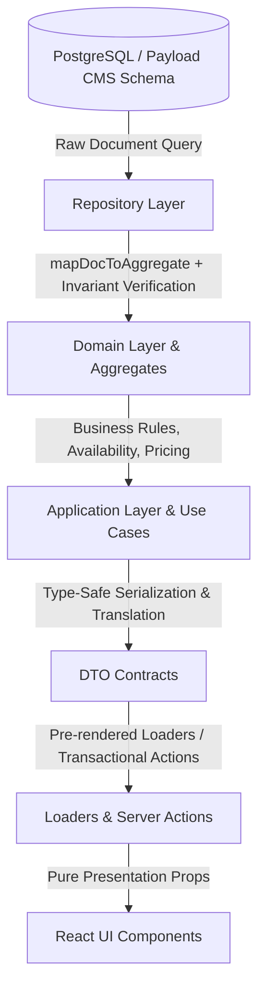

# Experience & Tour Vertical Data Flow Map (Mandatory Architectural Contract)

> **AUTHORITY DECLARATION:**  
> This document is the **single authoritative architectural map** for the **Experience / Tour Domain Vertical** in L'Aube Voyage.  
> Any AI agent, software engineer, or automated process modifying, extending, or consuming the Experience/Tour domain **MUST** read and strictly follow this vertical pipeline from Database to UI.  
> **Direct data shortcuts (e.g., Payload Schema ──► UI) or synthetic dynamic fallbacks are strictly prohibited.**

---

## 1. Vertical Architectural Overview

Every data point within the Experience / Tour domain must flow through a strictly unidirectional, layered pipeline:



### The Cardinal Rules of the Vertical:
1. **Unidirectional Flow:** Data only flows downward: $\text{DB} \longrightarrow \text{Repo} \longrightarrow \text{Domain} \longrightarrow \text{App} \longrightarrow \text{DTO} \longrightarrow \text{Loader/Action} \longrightarrow \text{UI}$.
2. **Zero Direct Access:** React UI components must **NEVER** import Payload Local API, query database collections directly, or construct ad-hoc DTOs.
3. **Zero Business Logic in UI:** Pricing calculations, currency conversions, availability checks, tax/discount formulas, default slot selections, and capacity reservations belong **exclusively** in Domain/Application services and Server Actions.
4. **Zero Synthetic Dynamic Data:** No `: 20`, `|| 1`, `?? 'Egypt'`, `|| 5.0`, or Unsplash mock image fallbacks. If data is missing from DB, it is either an **Explicit Fail-Fast Error** (for required fields) or an **Explicit Legitimate Empty State** (for optional fields).

---

## 2. Canonical File & Directory Map

| Layer | Canonical Location in Codebase | Primary Responsibility |
| :--- | :--- | :--- |
| **1. Database / CMS Collections** | `src/collections/Experiences.ts`<br>`src/collections/DepartureSlots.ts`<br>`src/collections/Cities.ts`<br>`src/collections/Countries.ts`<br>`src/collections/Media.ts` | Schema definition, database relationships, field validations, hooks, access control. |
| **2. Repositories** | `src/domains/experience/repository.ts`<br>`src/domains/destination/repository.ts` | Database queries via Payload Local API, mapping raw CMS documents to Domain Aggregates, enforcing fail-fast data invariants. |
| **3. Domain & Aggregates** | `src/domains/experience/aggregate.ts`<br>`src/domains/experience/service.ts`<br>`src/domains/experience/workflow.ts`<br>`src/domains/experience/bookable-departure.ts`<br>`src/domains/experience/pricing-policy-registry.ts`<br>`src/domains/experience/types.ts`<br>`src/domains/destination/service.ts` | Pure business entities, state invariants, capacity holds, optimistic concurrency, pricing policy registry, default slot resolution. |
| **4. Application Use Cases** | `src/application/booking/pricing-usecase.ts`<br>`src/application/factory.ts` | Orchestrating domain workflows, coordinate localization context with frozen pricing snapshots, multi-domain interactions. |
| **5. DTO Contracts** | `src/application/experience/dto-details.ts`<br>`src/application/experience/dto.ts`<br>`src/application/destination/dto.ts`<br>`src/application/booking/dto-checkout.ts` | Immutable, serializable data contracts tailored for client consumption with complete type safety. |
| **6. Loaders & Server Actions** | `src/application/experience/loaders-details.ts`<br>`src/application/experience/loaders.ts`<br>`src/application/destination/loaders.ts`<br>`src/application/actions/pricing-actions.ts`<br>`src/application/actions/booking-actions.ts` | Server-side data fetching (`loadBySlug`), multi-field localization batching, on-demand slot materialization, transactional checkout actions. |
| **7. Server Route Pages** | `src/app/(frontend)/(public)/experiences/[slug]/page.tsx`<br>`src/app/(frontend)/(public)/experiences/page.tsx`<br>`src/app/(frontend)/(public)/destinations/[countrySlug]/[citySlug]/page.tsx`<br>`src/app/(frontend)/(public)/checkout/[bookingId]/page.tsx` | Next.js Server Components, reading cookies/headers for locale/currency context, invoking Loaders, handling `notFound()` and authentication guards. |
| **8. UI Presentation Components** | `src/components/features/experience/ExperienceDetailsPage.tsx`<br>`src/components/features/experience/ExperiencesCatalogPage.tsx`<br>`src/components/features/destination/CityExperiencesPage.tsx`<br>`src/components/features/checkout/CheckoutPage.tsx`<br>`src/components/widgets/home/FeaturedExperiencesWidget.tsx` | Pure presentation components. Renders authoritative DTO props, handles user interaction, delegates runtime calculations to Server Actions. |

---

## 3. Detailed Layer Contracts

### Layer 1: Payload CMS Schema (`src/collections/Experiences.ts`)
* **Collection Slug:** `experiences`
* **Key Fields & Groups:**
  * `slug`: Text (Unique, required, index).
  * `title`: Text (Required).
  * `type`: Select (`package` | `daily_tour`, required).
  * `city`: Relationship to `cities` (Required).
  * `duration`: Group (Required) ──► `days`: Number ($\ge 1$, required), `nights`: Number ($\ge 0$, optional).
  * `price`: Number (Required, base catalog price in EGP).
  * `hero`: Relationship to `media` (Upload, optional).
  * `gallery`: Array of `{ image: upload to media }` (Optional).
  * `itinerary`: Array of `{ dayNumber, title, description, includedMeals }` (Optional).
  * `included`: Array of `{ text: string }` (Optional).
  * `excluded`: Array of `{ text: string }` (Optional).
  * `policies`: RichText / Lexical (Optional).
  * `schedules`: Array of `{ startTime: string, defaultCapacity: number, label?: string }` (Required for `daily_tour`).

---

### Layer 2: Repository Layer (`src/domains/experience/repository.ts`)
* **Mapping Function:** `mapDocToAggregate(doc: any): ExperienceAggregate`
* **Fail-Fast Invariants Enforced in Repository:**
  1. `doc.slug` must be a non-empty string.
  2. `doc.title` must be a non-empty string.
  3. `doc.city` must be a valid relationship (extracts `cityId`).
  4. `doc.duration.days` must be a valid number $\ge 1$. Throws if missing or $< 1$.
  5. `doc.price` must be a valid number $\ge 0$.
  6. For `daily_tour`: If `schedules` exist, every item must have a valid `startTime` (regex `^\d{2}:\d{2}$`) and `defaultCapacity \ge 1`.
  7. Converts Lexical `policies` to clean HTML via `serializeLexicalToHtml(doc.policies)`.
  8. Resolves `heroUrl` and `gallery` URLs from media docs without adding fake fallback images.

---

### Layer 3: Domain Layer (`src/domains/experience/`)
* **Aggregate Definition (`aggregate.ts`):**
  ```typescript
  export interface ExperienceAggregate {
    id: number
    slug: string
    title: string
    type: 'package' | 'daily_tour'
    cityId: number
    durationDays: number
    durationNights?: number
    price: number
    policiesHtml?: string
    schedules?: ScheduleConfig[]
    heroUrl?: string
    gallery: string[]
    itinerary: Array<{ dayNumber: number; title: string; description: string }>
    included: string[]
    excluded: string[]
    descriptionHtml?: string
  }
  ```
* **Domain Rules & Responsibilities:**
  * `resolveDefaultSlot(slots: DepartureSlotEntity[], todayStr: string): DepartureSlotEntity | null`:  
    Sorts future slots chronologically, filters by `status === 'available'` and `capacityAvailable > 0`, and returns the earliest active slot.
  * `getOrCreateDailyDeparture(experienceId, date, startTime, context)`:  
    Verifies that `startTime` matches a configured schedule in `experience.schedules`. Checks DB for existing slot on `(experienceId, date, startTime)`. If not found, materializes a concrete `DepartureSlotEntity` in DB with `capacityTotal = schedule.defaultCapacity` and returns the real record.

---

### Layer 4: Application Layer & Use Cases (`src/application/`)
* **Pricing Coordination (`pricing-usecase.ts`):**  
  Accepts `{ experienceId, slotId, adultsCount, childrenCount, ctx }`. Resolves slot departure, executes pricing pipeline with currency conversion via `PricingFacade`, generates immutable `PricingSnapshotData`, and returns formatted `ConvertedPrice` view models.
* **City & Country Resolution:**  
  `ExperienceDetailsLoader` queries `destination.getCityById(exp.cityId)` with `depth: 1` to resolve the authentic city name and parent country name. If either is missing, it formats cleanly without injecting `'Egypt'`.

---

### Layer 5: DTO Contract (`src/application/experience/dto-details.ts`)
```typescript
export interface DepartureSlotDTO {
  id: number
  departureId: string
  departureDate: string
  startTime?: string
  availableSeats: number
  priceOverrideEGP?: number
  status: DepartureSlotStatus
}

export interface ExperienceDetailsDTO {
  id: number
  slug: string
  title: string
  subtitle: string
  type: 'package' | 'daily_tour'
  location: string
  durationDays: number
  durationNights?: number
  rating: number
  reviewsCount: number
  initialAdults: number
  descriptionHtml: string
  images: string[]
  itinerary: Array<{ dayNumber: number; title: string; description: string }>
  departureSlots: DepartureSlotDTO[]
  defaultSlotId?: number | null
  schedules?: ScheduleConfig[]
  includedServices: string[]
  excludedServices: string[]
  policiesHtml?: string
  pricing: {
    unitPrice: ConvertedPrice
    totalPrice: ConvertedPrice
  }
}
```

---

### Layer 6: Loaders & Server Actions (`src/application/actions/`)
1. **`ExperienceDetailsLoader.loadBySlug(slug, options)`:**  
   Loads aggregate, resolves city/country, batch-translates strings via `localization.translateBatch`, resolves `defaultSlot` via domain policy, calculates initial pricing, and builds `ExperienceDetailsDTO`.
2. **`resolvePricingAction(params)` (Server Action):**  
   Runtime dynamic pricing resolver. Supports Package slot IDs or Daily Tour `date + startTime` slot materialization. Returns authoritative `{ unitPrice, totalPrice, slotId, departureId }`.
3. **`confirmCheckoutAction(params)` (Server Action):**  
   Transactional checkout engine. Locks capacity hold, creates booking draft, freezes pricing snapshot, and initializes payment session atomically.

---

### Layer 7: UI Presentation (`src/components/features/experience/`)
* **Component:** `ExperienceDetailsPage.tsx`
* **UI Rules:**
  1. Initialize `selectedSlotId` from `data.defaultSlotId ?? null`.
  2. For **Packages**: Render available departure slots from `data.departureSlots`. If empty, render an authentic empty state and disable booking.
  3. For **Daily Tours**: Render date input and `data.schedules` time buttons. When changed, invoke `resolvePricingAction` to fetch updated server pricing and materialized slot ID.
  4. Render `data.policiesHtml`, `data.itinerary`, `data.includedServices`, `data.excludedServices`, and `data.images` cleanly.
  5. **No calculations in React:** Total price is displayed directly from `pricingState.totalPrice`.

---

## 4. Practical Walkthrough: Adding a New Feature (e.g., Hotel Accommodations in Packages)

When adding a new business concept to the Experience vertical (e.g., `Hotels / Accommodation`), follow this **exact step-by-step procedure**:

### Step 1: Database / Payload CMS Schema
1. Open or create the collection schema: `src/collections/Experiences.ts` (or `src/collections/Hotels.ts` if a relational collection).
2. Add the field definition to `Experiences.ts`:
   ```typescript
   {
     name: 'accommodations',
     type: 'array',
     label: 'Hotel Accommodations',
     admin: {
       condition: (data) => data?.type === 'package',
     },
     fields: [
       { name: 'hotelName', type: 'text', required: true },
       { name: 'hotelStars', type: 'number', min: 1, max: 5 },
       { name: 'roomType', type: 'text' },
       { name: 'city', type: 'relationship', relationTo: 'cities' },
     ],
   }
   ```

### Step 2: Domain Aggregate & Invariants
1. Update `src/domains/experience/aggregate.ts`:
   ```typescript
   export interface AccommodationEntity {
     hotelName: string
     hotelStars?: number
     roomType?: string
     cityId?: number
   }

   export interface ExperienceAggregate {
     // ... existing fields
     accommodations?: AccommodationEntity[]
   }
   ```
2. Update `src/domains/experience/repository.ts` in `mapDocToAggregate`:
   ```typescript
   const rawAccommodations = Array.isArray(doc.accommodations) ? doc.accommodations : []
   const accommodations: AccommodationEntity[] = rawAccommodations.map((acc: any) => {
     if (!acc.hotelName || typeof acc.hotelName !== 'string') {
       throw new Error(`[ExperienceRepository] Experience #${doc.id} accommodation is missing required hotelName.`)
     }
     return {
       hotelName: acc.hotelName.trim(),
       hotelStars: typeof acc.hotelStars === 'number' ? acc.hotelStars : undefined,
       roomType: acc.roomType ? String(acc.roomType).trim() : undefined,
       cityId: typeof acc.city === 'object' ? acc.city?.id : (typeof acc.city === 'number' ? acc.city : undefined),
     }
   })
   ```

### Step 3: Application DTO Contract
1. Update `src/application/experience/dto-details.ts`:
   ```typescript
   export interface AccommodationDTO {
     hotelName: string
     hotelStars?: number
     roomType?: string
   }

   export interface ExperienceDetailsDTO {
     // ... existing fields
     accommodations?: AccommodationDTO[]
   }
   ```

### Step 4: Application Loader Mapping & Translation
1. Update `src/application/experience/loaders-details.ts`:
   * If hotel names or room types require translation, include them in `localization.translateBatch`.
   * Map `exp.accommodations` directly into `accommodations: AccommodationDTO[]`.

### Step 5: UI Presentation Component
1. Update `src/components/features/experience/ExperienceDetailsPage.tsx`:
   * Add a dedicated presentation section:
     ```tsx
     {data.accommodations && data.accommodations.length > 0 && (
       <div className="border-t border-slate-200 dark:border-slate-800 pt-8">
         <h2 className="text-3xl font-extrabold mb-6">Hotel Accommodations</h2>
         <div className="grid grid-cols-1 sm:grid-cols-2 gap-4">
           {data.accommodations.map((hotel, idx) => (
             <Card key={idx} variant="flat" padding="md">
               <h3 className="text-lg font-bold">{hotel.hotelName}</h3>
               {hotel.hotelStars && <span className="text-amber-500">{'★'.repeat(hotel.hotelStars)}</span>}
               {hotel.roomType && <p className="text-sm text-slate-500">{hotel.roomType}</p>}
             </Card>
           ))}
         </div>
       </div>
     )}
     ```
   * Notice: If `data.accommodations` is empty or undefined, it cleanly hides the section (**Legitimate Empty State D**), without inventing a fake `"5-Star Luxury Nile Resort"` hotel.

### Step 6: Automated Regression Tests
1. Add unit tests in `tests/unit/experience/repository-mapping.unit.spec.ts` testing:
   - Valid accommodation mapping.
   - Fail-fast when `hotelName` is corrupt/missing.
2. Add component test in `tests/unit/components/experience-details-page.unit.spec.tsx` verifying authentic rendering.
3. Run `pnpm vitest run` and `pnpm build` to verify 100% green build.

---

## 5. Master Source-of-Truth Checklist for Code Reviews

Before submitting any changes to the Experience vertical, verify every row in this checklist:

- [ ] **Schema First:** The field is declared in `src/collections/Experiences.ts` or related collection.
- [ ] **Fail-Fast Mapping:** The field is mapped in `ExperienceRepository.mapDocToAggregate` with explicit validation for required properties.
- [ ] **Aggregate Representation:** The field exists on `ExperienceAggregate` without loose `any` types.
- [ ] **DTO Contract:** The field is declared in `ExperienceDetailsDTO` (or relevant catalog DTO).
- [ ] **Loader Transformation:** The field is mapped in `ExperienceDetailsLoader` with localization support if applicable.
- [ ] **UI Presentation:** The field is consumed in `ExperienceDetailsPage.tsx` (or related page) as pure presentation.
- [ ] **Zero Synthetic Values:** Grep search confirms 0 instances of `|| 1`, `?? 20`, `|| 'Egypt'`, `|| 5.0`, `unsplash`, or silent catch blocks in modified files.
- [ ] **Automated Tests:** Unit and integration tests cover both valid data and corrupted data fail-fast cases.
- [ ] **Full Build Verification:** `pnpm vitest run` and `pnpm build` pass with 0 failures and 0 TypeScript errors.
