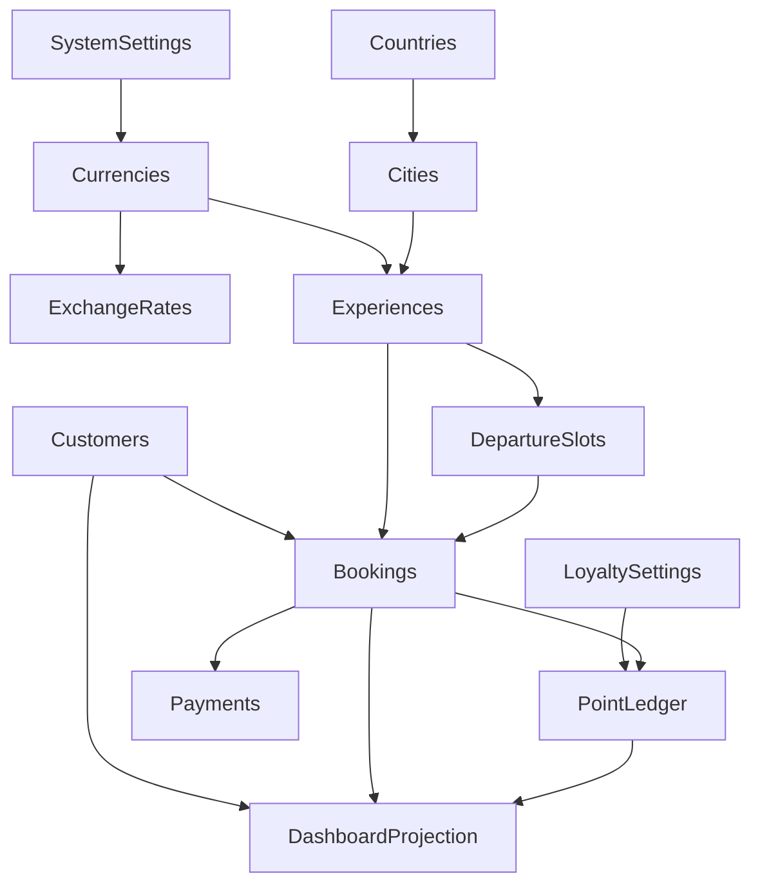

# System Dependency Graph & Aggregates Constraints

This document defines the structural and behavioral relationships between all data aggregates in the **L'Aube Voyage** application. It establishes downstream dependencies, cascade boundaries, immutable guards, and consistency limits to govern data modifications.

---

## 1. System Aggregates & Relational Topology

---

## 2. Comprehensive Aggregate Dependency Mapping

### A. SystemSettings Aggregate (Global)
* **Aggregates it Depends On:** `Currencies` (Base system currency EGP, default display currency).
* **Downstream Aggregates:** `ExchangeRates` (sync configs), `Experiences` (VAT calculations), `Bookings` (VAT application).
* **Cascading Effects (What breaks on change?):** Altering base/display currency breaks exchange sync pipelines. Changing VAT rules immediately shifts all pricing calculations globally.
* **Rebuild Requirements:** In-process system registry memory must be cleared immediately. Pricing calculators must re-read layout settings.
* **Static Guards (What must remain as is?):** The platform base currency **must remain locked to EGP** to avoid double exchange conversion issues.
* **Consistency Boundary Limit:** Strong consistency within System Domain writes.

---

### B. Currencies & ExchangeRates Aggregate
* **Aggregates it Depends On:** `SystemSettings` (configuration metadata).
* **Downstream Aggregates:** `Experiences` (pricing conversions), `Bookings` (price snapshots), `Payments` (gateway currencies), `DashboardProjections` (wallet values).
* **Cascading Effects (What breaks on change?):** Altering exchange rates changes experience pricing displays instantly. Modifying active status of currency breaks customer display selectors.
* **Rebuild Requirements:** Invalidate RAM `rateRegistry` and `catalogRegistry` caches immediately. Clear presentation layers referencing prices.
* **Static Guards (What must remain as is?):** Rate decimals must remain immutable to prevent rounding errors during calculations. Active status of base currency EGP cannot be set to `false`.
* **Consistency Boundary Limit:** Strong consistency for currency changes. If an active currency is deleted or set to inactive, all bookings referencing that currency as their displayed price must remain unaffected (pricing snapshots inside bookings are historically isolated).

---

### C. Destination (Countries & Cities) Aggregate
* **Aggregates it Depends On:** None.
* **Downstream Aggregates:** `Experiences` (each experience must be linked to a valid city).
* **Cascading Effects (What breaks on change?):** Setting a country/city to inactive breaks dynamic routes and search indexes for all associated experiences.
* **Rebuild Requirements:** Invalidate `countryCatalogRegistry` cache. Rebuild Next.js static paths `/destinations` and `/destinations/[countrySlug]/[citySlug]`.
* **Static Guards (What must remain as is?):** Deleting a country/city containing active experiences is strictly prohibited.
* **Consistency Boundary Limit:** Strong consistency in Destination changes.

---

### D. Experience & DepartureSlots Aggregate
* **Aggregates it Depends On:** `Cities` (Destination lookup).
* **Downstream Aggregates:** `Bookings` (references Experience ID and Departure Slot ID).
* **Cascading Effects (What breaks on change?):** Modifying availability to `sold_out` prevents new bookings. Altering slot dates or capacity slots locks checkout flows.
* **Rebuild Requirements:** Purge dynamic Next.js paths `/experiences/[slug]` and tag `experiences`.
* **Static Guards (What must remain as is?):** Base pricing can change, but historical slots or active bookings cannot have their pricing altered retroactively. Deleting an experience with paid/confirmed bookings is strictly blocked.
* **Consistency Boundary Limit:** Transactional Strong Consistency. Slot capacity adjustments (reserving/releasing slots) must occur atomically inside the database transaction of the booking checkout or cancellation.

---

### E. Booking Aggregate (Core transaction)
* **Aggregates it Depends On:** `Customers` (User ID), `Experiences` (Experience ID), `DepartureSlots` (Slot ID).
* **Downstream Aggregates:** `Payments` (Invoice referencing booking number), `PointLedger` (Earned points mapped to booking).
* **Cascading Effects (What breaks on change?):** Transitioning booking state (e.g. from `paid` to `confirmed`) triggers point awards, notification runs, and slot capacity lock commits.
* **Rebuild Requirements:** Rebuild `CustomerPortalProjection` Read Model (Active Rebuild via Subscriber). Invalidate Next.js paths `/dashboard/bookings` and customer tags.
* **Static Guards (What must remain as is?):** Booking pricing snapshots (`pricingSnapshot` JSON field containing base price, subtotal, VAT, currency, and conversion rate) are strictly immutable once a booking is saved, protecting billing history.
* **Consistency Boundary Limit:**
  * **Strong (Strict Transaction):** Booking validation, slot capacity decrement, and payment log entries must be atomic.
  * **Eventual:** Dashboard projection compile, user notification queuing, and search re-indexing happen asynchronously.

---

### F. Customer Aggregate (User/Identity)
* **Aggregates it Depends On:** None.
* **Downstream Aggregates:** `Bookings` (owner relation), `PointLedger` (points owner), `DashboardProjections` (user details).
* **Cascading Effects (What breaks on change?):** Updating status to `suspended` immediately denies customer dashboard login access.
* **Rebuild Requirements:** Rebuild customer portal projection read model. Purge presentation tags.
* **Static Guards (What must remain as is?):** Customer email is the unique primary login key and cannot be updated to duplicate emails. Staff/Admin users must reside in the separate `users` collection.
* **Consistency Boundary Limit:** Strong consistency for auth and registration. Customer profile edits have Eventually Consistent dashboard rendering.

---

### G. PointLedger Aggregate (Loyalty Ledger)
* **Aggregates it Depends On:** `Customers` (Owner), `Bookings` (Reference ID).
* **Downstream Aggregates:** `DashboardProjections` (points balance).
* **Cascading Effects (What breaks on change?):** Inserting point earn/redeem transactions updates the projected user balance and may trigger level upgrades.
* **Rebuild Requirements:** Re-evaluate current user tier status. Trigger Active Rebuild of dashboard read model. Invalidate `/dashboard/loyalty` presentation.
* **Static Guards (What must remain as is?):** Ledger records are **strictly append-only and immutable**. Adjustments (refunds/reversals) must be written as separate correction rows. Direct column writes to the `customers.loyaltyPoints` field are prohibited; balance is resolved from ledger history.
* **Consistency Boundary Limit:**
  * **Strong (Strict Transaction):** Deducting points at booking checkout or reversing points on cancellation must run inside the Booking mutation write transaction.
  * **Eventual:** Tier evaluations and dashboard widget balance numbers are eventually consistent.

---

## 3. Dependency Summary Matrix

| Aggregate | Critical Downstream Aggregates | Cascade Rules (On Update/Delete) | Immutable Guards | Transactional / Consistency Boundaries |
| :--- | :--- | :--- | :--- | :--- |
| **SystemSettings** | `Experiences`, `Bookings` | Cannot delete default EGP base currency configuration. | Base currency locked to EGP. | Strong |
| **ExchangeRates** | `Experiences`, `Payments` | Updates trigger price conversions across all tours. | Rate decimals and codes. | Strong |
| **Destination** | `Experiences` | Cannot delete country/city with active tour packages. | Reference relation to active Experiences. | Strong |
| **Experience** | `DepartureSlots`, `Bookings` | Deleting experience cascade-cancels slots. Cannot delete if active bookings exist. | Historical slot prices and slots with active bookings. | Strong (Capacity lock) |
| **Booking** | `Payments`, `PointLedger`, `Dashboard` | Transition triggers points, invoices, and messaging. | Pricing snapshots. | Strong (State transitions) / Eventual (Dashboard) |
| **Customer** | `Bookings`, `Dashboard` | Suspension blocks active logins. | Email uniqueness. User/Customer collection separation. | Strong |
| **PointLedger** | `Dashboard` | Point changes triggers tier evaluations. | Append-only. No direct database updates. | Strong (Transactional checkout logs) |
