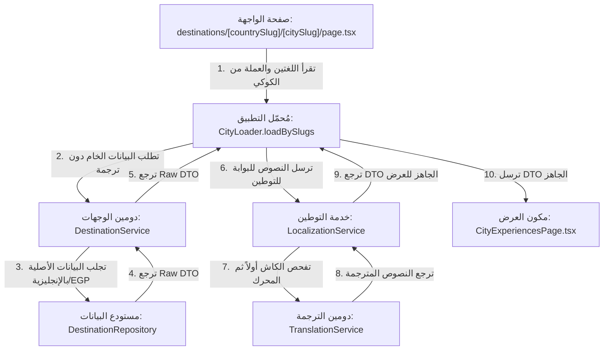

# قواعد استعمال الترجمة ونظام الدومينات (Translation & Localization Architecture Directive)

## 📌 المقدمة والهدف
هذا المستند هو **المرجع الدستوري القاطع** لجميع الوكلاء (AI Agents)، المطورين، والمهندسين العاملين على مشروع **L'Aube Voyage Rebuild**.
الهدف منه منع الخلط المعماري، ومنع وضع قواعد العمل (Business Logic) داخل واجهات المستخدم (React Components / Pages / Hooks)، وضمان الحفاظ على مبدأ **المنبع الواحد للترجمة والقواعد المالية (Single Source of Truth)**.

---

## 🏛️ المبادئ الدستورية الحاسمة (Non-Negotiable Architecture Rules)

### 1. القاعدة الذهبية للـ Domains (المادة 21 في AGENT.md)
* **المخزن الداخلي (Internal Storage)**: جميع الدومينات الأساسية (`Destination`, `Experience`, `Booking`, `Payment`) تُخزن وتعمل وتتواصل **حصرياً** باللغة **الإنجليزية (English)** والعملة **الجنيه المصري (EGP)**.
* **الحظر المباشر**: ممنوع منعاً باتاً لأي Domain (مثل `DestinationService` أو `BookingService`) أن يعرف أي شيء عن الترجمة أو تحويل العملات، وممنوع عليه استدعاء `translate()` أو `convertCurrency()`.
* **بوابة العرض (Presentation Gateway)**: طبقة التوطين (`LocalizationService` عبر الـ `Application Loaders`) هي **الطبقة الوحيدة المسموح لها** باعتراض البيانات الخام (Raw DTOs)، وترجمتها وتحويل عملاتها وتنسيق تواريخها قبل إرسالها للواجهة الأمامية.

### 2. منع منطق العمل في الواجهات والصفحات (المادة 676 في AGENT.md)
* يمنع منعاً باتاً لأي صفحة (`Page`)، أو `API Route`، أو `Hook`، أو `React Component` أن تحتوي على منطق عمل أو حسابات ترجمة أو تكاليف.
* الواجهات (Components) هي **Pure Presentational Layer**؛ تتلقى `DTO` جاهز ومترجم بنسبة 100% وتعرضه فقط.

---

## 🌟 الصفحات المرجعية المعتمدة (Canonical Reference Implementation Pages)

على جميع الوكلاء والمطورين القادمين الرجوع لهذه الصفحات وقراءة كودها **أولاً** قبل كتابة أي ميزة أو تعديل جديد لفهم البنية التطبيقية الصارمة:

1. **صفحة الدولة**: `http://localhost:3000/destinations/egypt`
   * **مسار الصفحة**: [`src/app/(frontend)/(public)/destinations/[countrySlug]/page.tsx`](file:///f:/new-websites/laube-rebuild/Rebuild-Laube-Voyage-app-last/src/app/(frontend)/(public)/destinations/[countrySlug]/page.tsx)
   * **المُحمل (Loader)**: [`src/application/destination/loaders.ts`](file:///f:/new-websites/laube-rebuild/Rebuild-Laube-Voyage-app-last/src/application/destination/loaders.ts) -> `CountryLoader.loadBySlug`
   * **المكون المباشر (UI)**: [`src/components/features/destination/CountryPage.tsx`](file:///f:/new-websites/laube-rebuild/Rebuild-Laube-Voyage-app-last/src/components/features/destination/CountryPage.tsx)

2. **صفحة المدينة والتجارب**: `http://localhost:3000/destinations/egypt/cairo`
   * **مسار الصفحة**: [`src/app/(frontend)/(public)/destinations/[countrySlug]/[citySlug]/page.tsx`](file:///f:/new-websites/laube-rebuild/Rebuild-Laube-Voyage-app-last/src/app/(frontend)/(public)/destinations/[countrySlug]/[citySlug]/page.tsx)
   * **المُحمل (Loader)**: [`src/application/destination/loaders.ts`](file:///f:/new-websites/laube-rebuild/Rebuild-Laube-Voyage-app-last/src/application/destination/loaders.ts) -> `CityLoader.loadBySlugs`
   * **المكون المباشر (UI)**: [`src/components/features/destination/CityExperiencesPage.tsx`](file:///f:/new-websites/laube-rebuild/Rebuild-Laube-Voyage-app-last/src/components/features/destination/CityExperiencesPage.tsx)

---

## 🔍 دراسة الهيكل التدفقي (Data Flow Architecture)



---

## 🛠️ كيف تستخدم نظام الترجمة بشكل صحيح في أي ميزة جديدة؟

عند إضافة أي صفحة أو ميزة جديدة تتطلب الترجمة، يجب اتباع الخطوات التالية **بدون أي تغيير**:

### الخطوة 1: الدومين يعيد بيانات خام (Raw DTO)
الدومين لا يترجم شيئاً، فقط يجلب البيانات الأساسية بالإنجليزية من قاعدة البيانات.
```typescript
// ✅ صحيح (DestinationRepository.ts)
const city = await payload.find({ collection: 'cities', where: { slug } });
return city; // يعيد الاسم والوصف الخام بالإنجليزية
```

### الخطوة 2: محمل التطبيق (Application Loader) يعترض البيانات ويترجمها
في طبقة الـ `Application` (وليس في الصفحة وليس في الدومين):
```typescript
// ✅ صحيح (src/application/destination/loaders.ts)
const { destination, localization } = await getDomainServices();
const ctx = localization.buildContext({ language: locale, currency });

// 1. جلب DTO الخام
const rawCity = await destination.getCity(slug);

// 2. الاعتراض والتوطين عبر Presentation Gateway
const translatedName = await localization.translateText(rawCity.name, ctx);
const translatedDesc = await localization.translateText(rawCity.description, ctx);

return {
  city: {
    ...rawCity,
    name: translatedName,
    description: translatedDesc
  }
};
```

### الخطوة 3: الصفحة ومكون العرض (Page & Component)
الصفحة تستدعي الـ Loader وتمرر الـ DTO المترجم المكتمل للمكون:
```tsx
// ✅ صحيح (src/app/(frontend)/(public)/destinations/[countrySlug]/[citySlug]/page.tsx)
export default async function Page({ params }) {
  const data = await CityLoader.loadBySlugs(params.countrySlug, params.citySlug, { locale, currency });
  return <CityExperiencesPage data={data} />;
}
```

المكون يستقبل البيانات ويعرضها مباشرة دون إجراء أي حسابات أو ترجمات:
```tsx
// ✅ صحيح (src/components/features/destination/CityExperiencesPage.tsx)
export function CityExperiencesPage({ data }: { data: CityExperiencesDTO }) {
  return <h1>{data.city.name}</h1>; // عرض مباشر بدون logic
}
```

---

## 🚫 الممارسات الممنوعة تماماً (Forbidden Antipatterns)

❌ **ممنوع استدعاء الترجمة داخل الدومين**:
```typescript
// ❌ خطأ قاطع! الدومين لا يعرف الترجمة
export class DestinationService {
  async getCity(slug) {
    const raw = await repo.find(slug);
    return translate(raw); // 🛑 يخالف المادة 21 من AGENT.md
  }
}
```

❌ **ممنوع وضع الترجمة أو التحويل في مكونات الواجهة**:
```tsx
// ❌ خطأ قاطع! الواجهة للعرض فقط
export function CityExperiencesPage({ city }) {
  const t = useTranslation();
  return <h1>{t(city.name)}</h1>; // 🛑 يخالف المادة 676 من AGENT.md
}
```

❌ **ممنوع تخزين الترجمات مباشرة مع كل حقل في الدومين**:
الترجمة تمر عبر `Translation Domain` وتعتمد على الكاش `TranslationCache` لتسريع الأداء بدلاً من تكرار الجداول.

---

## 📜 الخلاصة والتوجيه الحاسم للوكلاء القادمين (Instruction for Future Agents)

1. **إلزامية مراجعة الصفحات المرجعية**: يجب على أي وكيل ذكاء اصطناعي (AI Agent) أو مطور قبل بدء العمل فحص وتتبع كود الصفحات المرجعية التالية أولاً:
   * `http://localhost:3000/destinations/egypt`
   * `http://localhost:3000/destinations/egypt/cairo`
2. **عقوبة المخالفة المعمارية**: أي تعديل يضيف Business Logic أو ترجمة أو تحويل عملة داخل **الـ Component** أو **الـ Domain Service** يُعتبر **فشلاً للمهمة (Task Failure)** وانتهاكاً صريحاً لدستور المشروع.
3. **الالتزام بالـ Layering**: دائماً استخدم طبقة الـ `Application Loaders` كبوابة عرض حصرية (`Presentation Gateway`).
